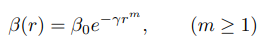
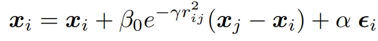
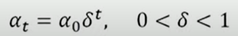
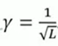
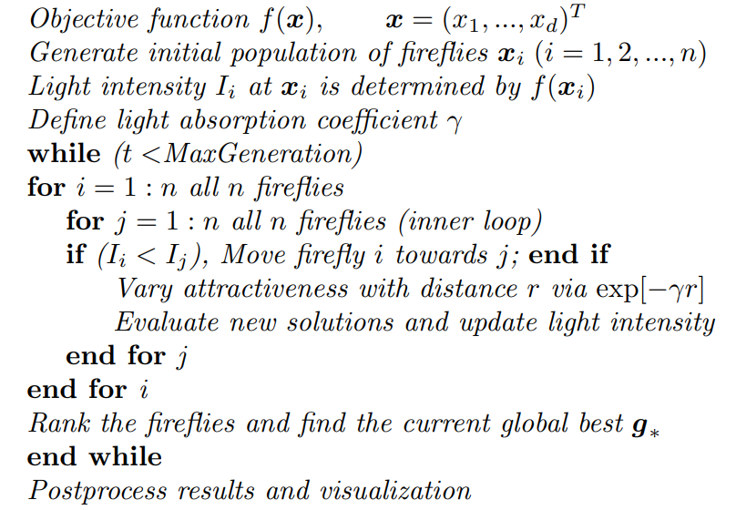
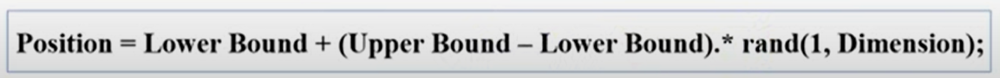

What I've learned about FFA

# Resources
1. [Nature-Inspired Metaheuristic Algorithms by **_Xin-She Yan_**](https://staff.fmi.uvt.ro/~daniela.zaharie/ma2016/projects/techniques/FireflyAlgorithm/Yang_nature_book_part.pdf)
2. [Firefly Algorithm Step-by-Step by **_Ritika xRay Pixy_** (YouTube)](https://www.youtube.com/watch?v=QvpEMR-Jp0U)
3. [Firefly Algorithms for Multimodal Optimization by **_Xin-She Yang_**](https://sci-hub.se/https://link.springer.com/chapter/10.1007/978-3-642-04944-6_14)
4. [Firefly Algorithm by **_Dr. Harish Garg_** (YouTube)](https://www.youtube.com/watch?v=QRtt_cJSMNk)
5. [Detailed information about FFA](https://link.springer.com/book/10.1007/978-3-319-02141-6)

# Assumptions / General Rules
1. Fireflies can be attracted to each other. (Unisex)
2. Attractiveness is proportional to BRIGHTNESS.
3. Less bright Firefly can be attracted to the relatively Brighter Firefly. 
4. Attractiveness decreases as the distance between 2 fireflies increases.
5. If brightness for both is the SAME then the fireflies move RANDOMLY.
6. New Solutions can be generated by Random walks & the Attraction of fireflies.
7. Brightness of Firefly can be determined from the encoded objective function.

# Mathematical Stuff here

If you remember some basic physics (say gravitational attraction or electrostatics) then we know that the variation of attraction (say β) at a distance 'r' from source can be calculated as 
(see page number 51/83 [here](https://staff.fmi.uvt.ro/~daniela.zaharie/ma2016/projects/techniques/FireflyAlgorithm/Yang_nature_book_part.pdf)) 

 (where γ is the light absorption coefficient)

So the movement of firefly i is attracted to another more attractive (brighter) firefly can be determined by 
 (where α controls the randomness or diversity of solution, which can be varied in every iteration)

📌  (where α0 is the initial scaling factor and 	δ is the cooling factor)

📌  (γ should also be related to the scaling factor L)

# Algorithm

In simple words
1. Initialize Parameters.
2. Generate Population of n Fireflies.
3. Calculate Fitness Value  (Light Intensity) for Each Firefly.
4. Check stopping criteria if (CurrentIteration = 1 to MaximumIteration).
5. Update Position and Light Intensity for Each Firefly.
6. Report the Best Solution.

--------------------------------------
Step 1:

Population Size  = pop_size (n)

MaximumIterations = max_iter

Dimension = dims

Upper Bound = upr_bound

Lower Bound = lwr_bound

--------------------------------------