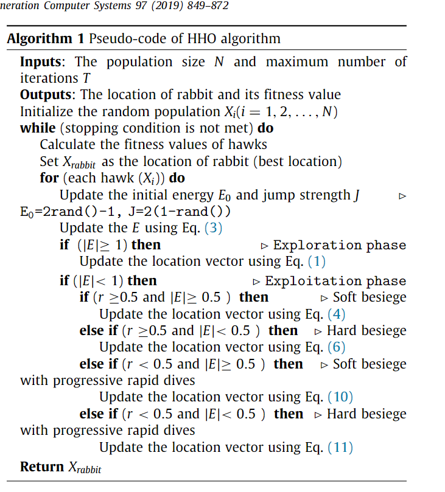

r1, r2, r3, r4, and q - "Random numbers between 0 and 1" and "updated in each iteration"

Xrand(t) - " randomly selected hawk from the current population "

Xm - " the average position of the current population of hawks " Mean of X, X is location of hawks

X (t + 1) = {  Xrand(t) − r1 * |Xrand(t) − 2r2X (t)| q ≥ 0.5
{ (Xrabbit (t) − Xm(t)) − r3(LB + r4(UB − LB)) q < 0.5

----

### Transition from exploration to exploitation

"The HHO algorithm can transfer from exploration to exploitation and then, change between \
different exploitative behaviors based on the escaping energy of the prey. \
The energy of a prey decreases considerably during the escaping behavior"

E = 2* E0 * (1 − t/T)

"E indicates the escaping energy of the prey\
T is the maximum number of iterations\
E0 is the initial state of its energy."

"In HHO, E0 randomly changes inside the interval (−1, 1) at each iteration."

"When the value of E0 decreases from 0 to −1, the rabbit is physically flagging,\
whilst when the value of E0 increases from 0 to 1, it means that the rabbit is strengthening."

#### Exploration happens when |E| ≥1 while exploitation happens in later steps when |E| <1

----

# Exploitation phase

"four possible strategies are proposed in the HHO to model the attacking stage"

"Suppose that r is the chance of a prey in successfully escaping \
(r < 0.5) or not successfully escaping (r ≥0.5) before surprise \
pounce. Whatever the prey does, the hawks will perform a hard or soft besiege to catch the prey"

1. "Soft besiege When r ≥ 0.5 and |E| ≥ 0.5"
   
        X (t + 1) = ∆X (t) − E |JXrabbit (t) − X (t)| (4)

        ∆X (t) = Xrabbit (t) − X (t)
        
        "r5 is a random number inside (0,1), and" J = 2(1 − r5) "represents the random jump strength of the rabbit"

2. "Hard besiege When r ≥0.5 and |E| <0.5"
   
       X (t + 1) = Xrabbit (t) − E |∆X (t)|

3. "Soft besiege with progressive rapid dives When still |E| ≥0.5 but r < 0.5"
       
        X (t + 1) = { Y if F (Y ) < F (X (t))
                    { Z if F (Z ) < F (X (t))
    
        Y = Xrabbit (t) − E |JXrabbit (t) − X (t)|
        Z = Y + S × LF (D)
    
    "use the LF function -  levy flight function"

4. "Hard besiege with progressive rapid dives When |E| <0.5 and r < 0.5"

        X (t + 1) = { Y if F (Y ) < F (X (t))
                    { Z if F (Z ) < F (X (t))

        Y = Xrabbit (t) − E |JXrabbit (t) − Xm(t)|

        Z = Y + S × LF (D)
---

